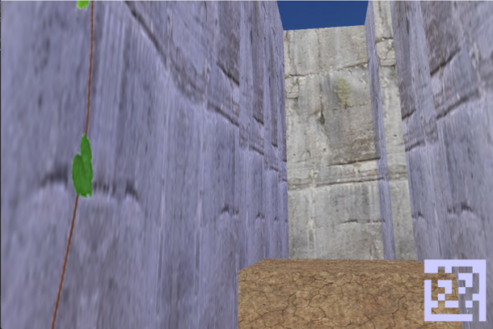

# 基于 OpenGL 的三维迷宫游戏

本仓库是一个有趣的第一人称三维迷宫游戏，适用于计算机图形学/软件工程大作业，大家可以参考，但请勿抄袭哦。

游戏源代码在 Code 文件夹中，软件工程的过程文档在 documents 文件夹中。

## 游戏简介
本仓库的主题为“基于OpenGL的三维峡谷探险迷宫设计”，项目的框架是基于Qt的OpenGL模块。

本次设计的3D迷宫游戏主要通过二维矩阵所表示的迷宫图，来构建三维立体场景。

我们为系统设计了一架摄像机，来模拟用户在迷宫中的第一视角，用户可以通过鼠标、键盘控制自己在3D迷宫中的移动。游戏也很好地设计了碰撞检测，给玩家以一种身临其境的感觉。

游戏中设置了各种各样的元素，包括可以翻阅的障碍围墙，岩浆陷阱，以及得分机关。我们完成了天空盒的设计并且引入了自己的光照模型，在天空盒动态移动的时候，光照阴影也会随之移动。

下面是本游戏的详细介绍

## 游戏场景
### 迷宫生成
生成迷宫的关键要求是确保存在一条从起点到终点的可达路径，并保持墙体密度适中，以避免创建多个不可达的空房间，这有助于保持迷宫的可玩性和有效面积。

迷宫可以视为一个图，因此可以使用Kruskal随机生成算法来生成迷宫。

  

### 峡谷贴图
1. 文件处理：打开BMP文件并验证其格式，确保其符合位图标准。
2. 数据读取：从文件中读取位图头信息，计算尺寸和像素总量，为图像数据分配内存。
3. OpenGL纹理创建：使用读取的数据创建OpenGL纹理，并设置纹理参数，如滤波方式和重复模式。
4. 资源管理：操作完成后，释放所有占用资源。
5. 格式和通道：将BMP转换为RGB格式，并关注不同的通道数量

  

可以看到墙壁我们选择了石头作为峡谷的表面纹理，地面就是土地的纹理，还有一些岩浆的纹理

### 天空盒制作
1. 启用立方体贴图：代码开启OpenGL的立方体贴图功能，用于天空盒的渲染。
2. 天空盒尺寸计算：根据迷宫大小计算天空盒的尺寸。
3. 设置和旋转天空盒：将天空盒置于原点并绕Y轴旋转，增加动态效果。
4. 纹理绑定和绘制：绑定立方体纹理并绘制天空盒的六个面。
5. 状态恢复和功能禁用：绘制后恢复OpenGL状态并禁用立方体贴图。

  

### 动态藤蔓纹理 
1. 动态纹理原理：实时生成或修改纹理来模拟环境变化。
2. 应用方式：根据事件、时间或用户互动改变纹理。
3. 实现方法：使用一组视觉上类似的纹理图像模拟动态效果。
4. 效果创造：游戏中循环使用这些纹理以产生动态效果。
5. 优势：简化实现过程，降低成本，增强真实感和互动性。

  

### 光照变化
1. 漫反射：模拟光源直接照射到物体上并均匀散射的光，亮度与入射角度相关。
2. 镜面反射：模拟光线在平滑表面的镜面反射，亮度与观察者视角有关。
3. 光照总效果：环境光、漫反射和镜面反射的综合，可能包括距离衰减。
4. 光源旋转实现：通过特定函数使光源绕轴旋转，动态计算和更新光源位置。

  

## 游戏机关
### 岩浆陷阱
* 每次画面更新时，要检查玩家是否踩中迸发的岩浆，如果踩中，则游戏结束，固定玩家的位置和视角；如果没有踩中陷阱，或者踩中陷阱时岩浆没有迸发，则无事发生。
* 玩家死亡不能移动的效果可以通过固定摄像机来实现，将前后移动速度、左右移动速度、垂直移动速度和视角移动速度都为 0
* 玩家死亡之后更新的每一帧都会触发 player->setFixed() 和 drawText 的死亡提示，从而实现游戏的结束
  

### 土块障碍
* 在前进的路上会有土块障碍，它的实现与墙壁类似
* 因为土块障碍的高度较低，因此可以进行翻越
* 只需要用过跳跃即可翻越，跳起的高度完全可以翻越矮墙。

  

### 终点机关
1. 机关放置：在Kruskal算法生成的迷宫中，选择一个空房间放置机关，并标记为特殊值。
玩家检查机关：玩家通过检查当前位置的值来判断是否到达机关位置。
2. 机关激活：玩家到达机关位置时触发机关的激活。
终点检查机制：设置一个布尔变量，用于在玩家到达终点时检查机关是否已激活。
3. 游戏结束提示：根据机关是否激活，显示不同的提示信息，指示游戏是否完成

  

### 小地图
1. 小地图定位：设定小地图的尺寸和位置，并保存当前OpenGL状态。
2. 迷宫绘制：使用正交投影遍历绘制迷宫单元，用白色表示墙壁和元素。
3. 玩家位置标记：计算并以小点形式标记玩家在小地图上的位置。
4. 视图恢复：完成绘制后恢复OpenGL状态，将视口还原至主视图

  

## 游戏交互
### 前后左右移动（支持多键输入）

* 按键事件处理：使用两个函数分别处理键盘按键的按下和释放事件。
*  按键状态跟踪：keyStates 是一个映射（如字典或哈希表），记录每个按键的当前状态（激活或非激活）。
*  游戏逻辑更新：updatespacestate 函数根据 keyStates 映射中的激活按键更新玩家状态，并执行相应动作
  

  

### 跳跃与下坠
* 跳跃状态更新：updateJumpState 函数管理跳跃动作。如果玩家正在跳跃且未固定位置，则根据当前时间和跳跃开始时间，使用物理公式计算跳跃高度。
*  跳跃碰撞检测：计算玩家当前位置对应的迷宫块，进行Z轴方向碰撞检测。如果达到预设高度或迷宫边界，跳跃结束，重置相关高度参数。
*  垂直位置更新：在跳跃过程中，更新玩家或摄像机的垂直位置（Y轴）。
*  下坠状态更新：updateFallState 函数处理自然下坠。当玩家既不在跳跃也不在下坠，且高于当前块表面时，开始下坠。
*  下坠计算与结束：使用物理公式根据下坠时间计算下坠高度。如果到达块上表面，下坠结束，并更新相关高度参数。
* 摄像机/玩家位置更新：在下坠过程中，同样更新玩家或摄像机的垂直位置。

## 效果预览

  

